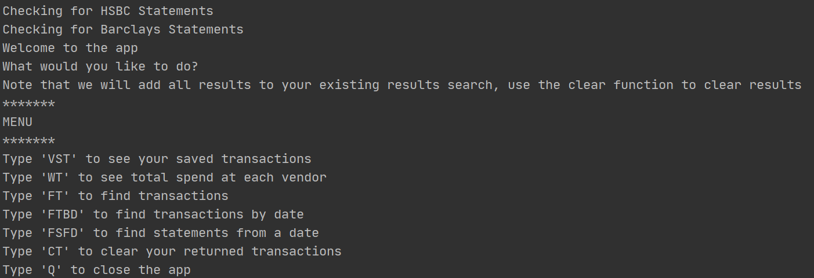

# The Statement Analytics console application
## Reading PDF Statements with iText7
Reading text straight from a PDF is made easy with the open source library iText7! Unfortunately that is where the ease ends.

Regex is used to determine whether a line of the pdf is relevant or not, bank statements are littered with useless info.
Another issue is the unfortunate formatting of some statements, you can see in the logic of the BarclaysStatement constructor that I 
had to add a catch for if the transaction details were blank as it meant that the details were actually on the next line!
Apart from this, the fact that statements don't yet have a standardised format is a pain as it means I have to have access to the statements
I want to add so I can figure out what goes wrong in the process of getting text from the PDF

## Functionality
* Transaction search
    * By date range
    * By transaction details
    * Save multiple results to a single set
        * Clear result set
        * Print result set
 * Get a summary of total spend at each vendor
 * Get statement summaries for those within a date range
 
 
