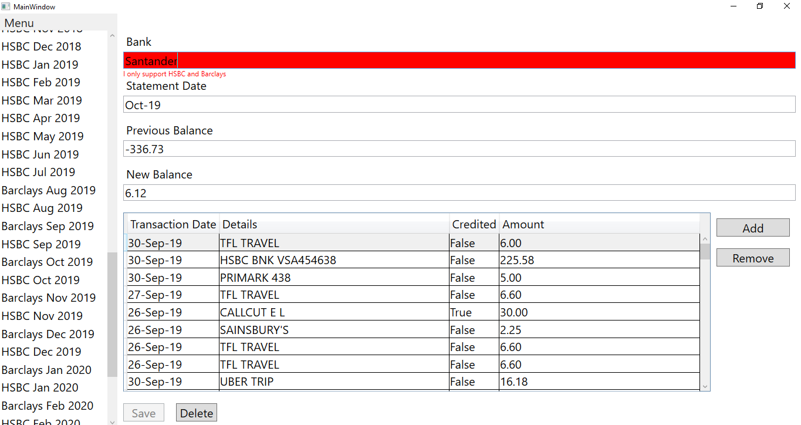
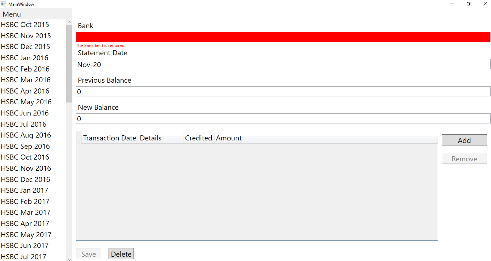
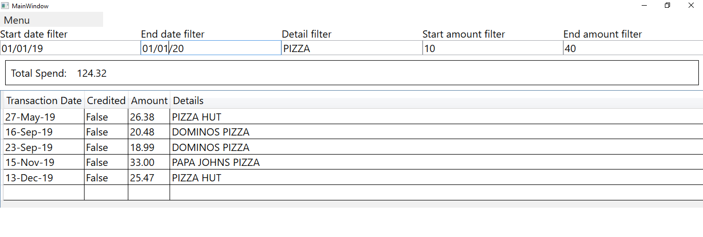

# Statement Analytics WPF App
## Technology used
#### MVVM
I built the app using the Model-View-ViewModel design pattern, with a ModelWrapper class which implements
the INotifyDataErrorInfo and INotifyPropertyChanged interfaces. The ModelWrapper then wraps our Models, the Statement
and the Transaction classes to allow for validation in the UI that takes into account both the attributes
on the base Model and new customised rules e.g. Only allowing the user to give HSBC or Barclays as their bank

 #### SQLite
 I chose a SQLite database as it can be stored with the repository and should aide with making this console app deployable 
 sometime in the future.
 
 #### EF Core
 Entity Framework Core is used between the app and the SQLite database. We have a small amount of code within
 StatementAnalyticsDesktop.DataAccess to set this up.
 
 The rest of our implementation lies inside of ./Data/ which contains Lookups which are our 'Bank Month Year' identifiers
 used in the side bar of our Statements window. It also contains Repositories which manage getting the Models from the db.
 
 GenericRepository.cs provides most of the basic functionality I need in the app such as checking for changes and saving.
 
 #### Prism
 Prism events are implemented within the ./Event/ folder and I use them to synchronise events such as clicking a lookup on the
 navigation view (left hand menu) and the statement being opened in the statement detail view
 
 #### Autofac
 Autofac is used for dependancy injection, see this at work in ./Startup/Bootstrapper.cs and ./App.xaml/App.xaml.cs where I assign 
 the implementations of interfaces
 

## Windows
#### Statements
The statements window shows all of your statements in a quick and easy view, with the 'Bank Month Year' identifier on the left
and your summaries statement being shown. You can edit all fields and have the ability to add and remove your transactions. 
There is also input validation live in the UI, for example we only allow the Banks HSBC and Barclays for now. 
If there is failure on any input we disable the save button so that we cannot even attempt to make these changes to the database.

#### Adding a new statement
I create a new statement with today's date, 0 new and previous balance and an empty set of transactions.

#### Transaction Search
The transaction search window allows you to search all your transactions simultaneously by a start date, end date, detail filter, start amount and end amount. 
The results update live as you type and the total spend accurately tracks the total amount on screen too. 
In the screenshot below I see how much money I spent on pizza between 01/01/2019 and 01/01/2020 which cost between £10 and £40

